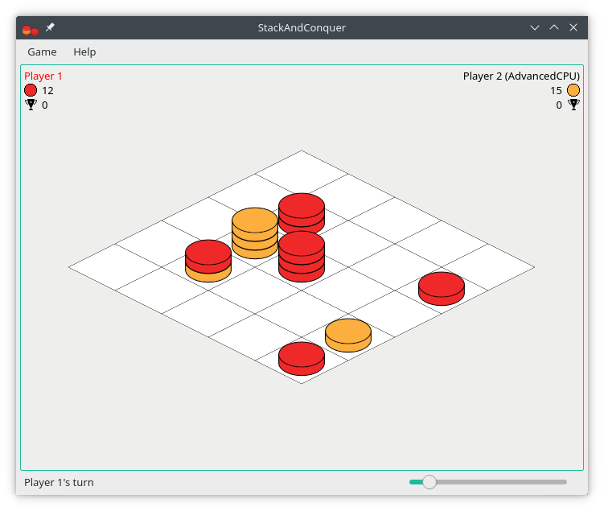

# StackAndConquer
Repository: https://codeberg.org/ElTh0r0/stackandconquer

StackAndConquer is a challenging tower conquest board game inspired by [Mixtour](https://spielstein.com/games/mixtour) created by Dieter Stein who allows free copying and using the rule texts and graphics under [CC license (BY-NC)](https://creativecommons.org/licenses/by-nc/4.0/). Objective is to build a stack of stones with at least five stones and a stone with the players color on top.

## Installation
* [Build for Windows](https://codeberg.org/ElTh0r0/stackandconquer/releases/latest)
* [AppImage](https://codeberg.org/ElTh0r0/stackandconquer/releases/latest)
* [Ubuntu PPA](https://launchpad.net/~elthoro/+archive/stackandconquer)
* [Builds for Debian, Fedora, openSUSE](http://software.opensuse.org/download.html?project=home%3AElThoro&package=stackandconquer)
* [Arch AUR](https://aur.archlinux.org/packages/stackandconquer/)

## Create CPU opponent
Manual for creating CPU opponents can be found in the [wiki](https://codeberg.org/ElTh0r0/stackandconquer/wiki/Create-CPU-opponent).

## Help translating
New translations and corrections are highly welcome! You can either fork the source code, make your changes and then create a pull request or you can participate on [translate.codeberg.org](https://translate.codeberg.org/engage/stackandconquer/)

Additionally see [this page](https://codeberg.org/ElTh0r0/stackandconquer/issues/30).
